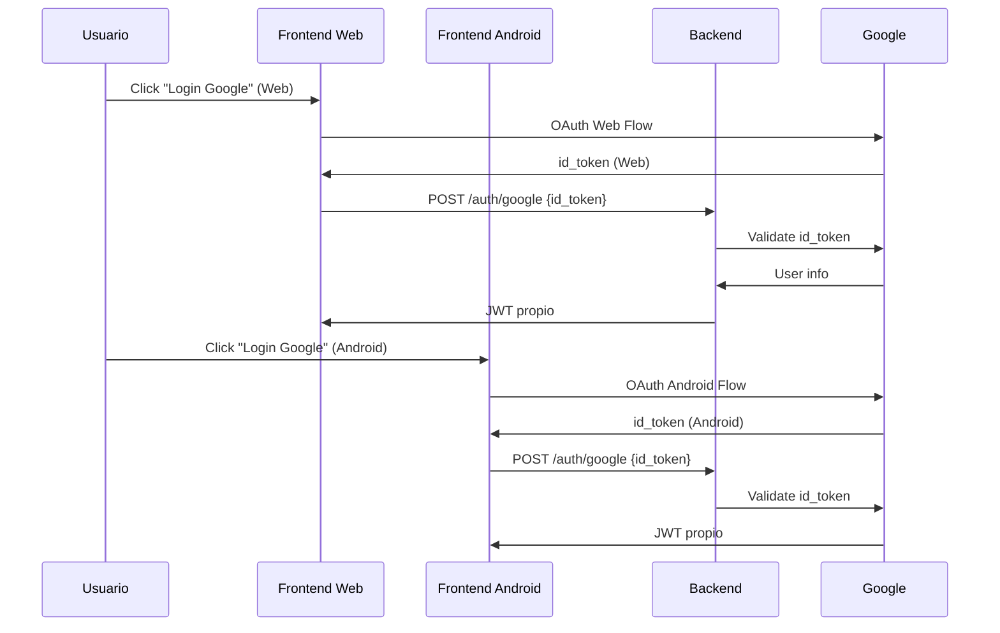

# 🚀 Guía de Configuración: Google Sign-In para Frontend (Web + Android)

Este documento detalla los pasos necesarios para configurar la autenticación con Google en la aplicación Flutter para **ambas plataformas: Web y Android**. Esta configuración es **adicional** a la configuración del backend que ya tienes.

## 🎯 Contexto del Proyecto

Nuestro proyecto FCT maneja:
- ✅ **Backend NestJS** (ya configurado con OAuth)
- 🔄 **Frontend Web** (Flutter Web)
- 🔄 **Frontend Android** (Flutter Android)

Cada uno requiere su **propio cliente OAuth** en Google Cloud Console.

## 📋 Clientes OAuth Necesarios

En el **mismo proyecto de Google Cloud Console** donde configuraste el backend, necesitas crear **DOS clientes OAuth adicionales**:

| Cliente | Tipo | Estado | Uso |
|---------|------|--------|-----|
| Backend | Aplicación Web | ✅ Configurado | Validación de tokens |
| Frontend Web | Aplicación Web | 🔄 Por configurar | Flutter Web |
| Frontend Android | Aplicación Android | 🔄 Por configurar | Flutter Android |

## 🌐 PARTE 1: Configuración para Flutter Web

### 1.1 Crear Cliente OAuth para Web

1. **Ve a [Google Cloud Console](https://console.cloud.google.com/)**
2. **Selecciona tu proyecto** (el mismo donde configuraste el backend)
3. **Ve a "APIs y servicios" → "Credenciales"**
4. **Haz clic en "+ CREAR CREDENCIALES" → "ID de cliente de OAuth 2.0"**
5. **Selecciona "Aplicación web"**
6. **Configura**:
   - **Nombre**: "FCT Frontend Web"
   - **Orígenes autorizados de JavaScript**:
     - `http://localhost:8080` (desarrollo Flutter Web)
     - `https://tu-dominio-frontend.com` (producción)
   - **URI de redirección autorizados**: 
     - `http://localhost:8080` (desarrollo)
     - `https://tu-dominio-frontend.com` (producción)

### 1.2 Configurar Flutter Web

Una vez obtengas el `CLIENT_ID` para web, configúralo en Flutter:

```dart
// Para Flutter Web, la configuración se hace en el código
const String webClientId = 'tu-web-client-id.apps.googleusercontent.com';
```

## 📱 PARTE 2: Configuración para Flutter Android

### 2.1 Generar Clave de Firma para Debug

1. **Abre una terminal** en el directorio raíz del proyecto (`Flutter_Proyectos_TFG/`)

2. **Ejecuta el siguiente comando** para generar el keystore:

   ```bash
   keytool -genkey -v -keystore ./frontend/android/app/debug.keystore -keyalg RSA -keysize 2048 -validity 10000 -alias androiddebugkey
   ```

   **Contraseña recomendada**: `android` (estándar para debug)

### 2.2 Configurar la Firma en Gradle

1. **Abre el archivo** `frontend/android/app/build.gradle`

2. **Añade la configuración** dentro del bloque `android { ... }`:

   ```groovy
   signingConfigs {
       debug {
           storeFile file('debug.keystore')
           storePassword 'android'
           keyAlias 'androiddebugkey'
           keyPassword 'android'
       }
   }
   
   buildTypes {
       debug {
           signingConfig signingConfigs.debug
       }
       // ... otras configuraciones
   }
   ```

### 2.3 Obtener la Huella SHA-1

1. **Navega al directorio** `frontend/android`
2. **Ejecuta**:

   ```bash
   ./gradlew signingReport
   ```

3. **Copia el valor SHA-1** que aparece en la salida:

   ```
   SHA1: XX:XX:XX:XX:XX:XX:XX:XX:XX:XX:XX:XX:XX:XX:XX:XX:XX:XX:XX:XX
   ```

### 2.4 Crear Cliente OAuth para Android

1. **En el mismo Google Cloud Console**, crea **otro cliente OAuth**
2. **Selecciona "Android"**
3. **Configura**:
   - **Nombre**: "FCT Frontend Android"
   - **Nombre del paquete**: `com.example.fct_frontend` (encuentra el tuyo en `AndroidManifest.xml`)
   - **Huella digital SHA-1**: Pega el valor que copiaste

### 2.5 Obtener el Nombre del Paquete

```bash
# Busca en este archivo:
frontend/android/app/src/main/AndroidManifest.xml

# Línea que contiene:
<manifest xmlns:android="http://schemas.android.com/apk/res/android"
    package="com.example.tu_app_name">
```

## 🔄 PARTE 3: Configuración del Código Flutter

### 3.1 Configuración Multiplataforma

```dart
// lib/core/config/oauth_config.dart
class OAuthConfig {
  // Cliente para web
  static const String webClientId = 'tu-web-client-id.apps.googleusercontent.com';
  
  // Cliente para Android (se obtiene automáticamente)
  // No necesitas configurar el Android Client ID en el código
}
```

### 3.2 Inicialización Condicional

```dart
// lib/core/services/auth_service.dart
GoogleSignIn _getGoogleSignIn() {
  if (kIsWeb) {
    return GoogleSignIn(
      clientId: OAuthConfig.webClientId,
    );
  } else {
    // Para Android, las credenciales se configuran automáticamente
    return GoogleSignIn();
  }
}
```

## 🔗 PARTE 4: Flujo de Integración Backend-Frontend

### 4.1 El Flujo Completo



### 4.2 Backend - Validación Universal

Tu backend **YA ESTÁ PREPARADO** para recibir tokens tanto de web como de Android:

```javascript
// El backend valida cualquier id_token válido de Google
@Post('google')
async googleAuth(@Body() { idToken }) {
  // Valida el token (funciona para web y Android)
  const payload = await this.googleService.verify(idToken);
  // Devuelve JWT propio
  return this.authService.generateJWT(payload);
}
```

## ✅ PARTE 5: Verificación y Testing

### 5.1 Verificar Configuración Web

```bash
# Ejecutar Flutter Web
cd frontend
flutter run -d chrome
```

### 5.2 Verificar Configuración Android

```bash
# Ejecutar en dispositivo/emulador Android
cd frontend  
flutter run -d android
```

### 5.3 Checklist Final

- [ ] ✅ Backend OAuth (ya configurado)
- [ ] 🔄 Cliente OAuth Web creado
- [ ] 🔄 Cliente OAuth Android creado  
- [ ] 🔄 SHA-1 de debug configurado
- [ ] 🔄 Keystore generado y configurado
- [ ] 🔄 Código Flutter actualizado
- [ ] 🔄 Testing en web funcionando
- [ ] 🔄 Testing en Android funcionando

## 🚨 Troubleshooting Común

### Error: "redirect_uri_mismatch" (Web)
- **Causa**: URIs de web mal configuradas
- **Solución**: Verificar orígenes y URIs en cliente web

### Error: "API not enabled" (Android)
- **Causa**: Google+ API no habilitada  
- **Solución**: Habilitar en "APIs y servicios"

### Error: "DEVELOPER_ERROR" (Android)
- **Causa**: SHA-1 incorrecto o paquete mal configurado
- **Solución**: Regenerar SHA-1 y verificar nombre del paquete

## 📝 Resumen de Credenciales

Al final tendrás **3 conjuntos de credenciales**:

| Tipo | CLIENT_ID | CLIENT_SECRET | Uso |
|------|-----------|---------------|-----|
| Backend | `xxx-backend.apps.googleusercontent.com` | `GOCSPX-xxx` | Validación |
| Web | `xxx-web.apps.googleusercontent.com` | - | Flutter Web |
| Android | `xxx-android.apps.googleusercontent.com` | - | Flutter Android |

---

**Importante**: Asegúrate de que el archivo `debug.keystore` **no se suba al control de versiones**. Añádelo a tu `.gitignore`.

**Última actualización**: 2025-07-28
**Estado**: Documentación actualizada para Web + Android 